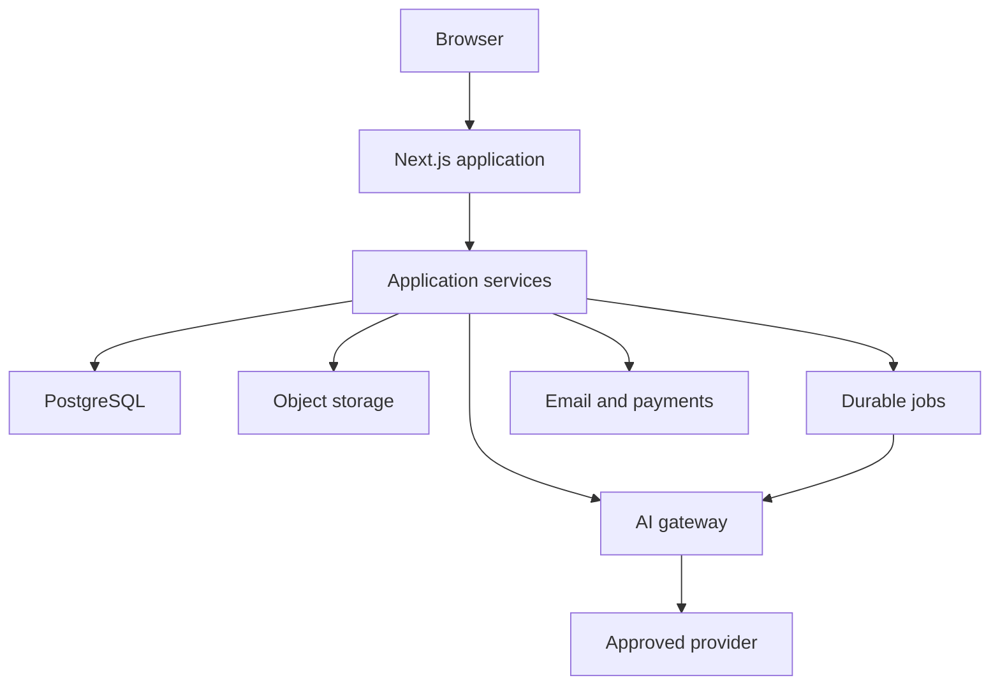

# System Architecture

## Goals

- Keep learning available when live AI is degraded.
- Isolate provider-specific behavior.
- Make authorization and tenancy explicit.
- Preserve reproducible assessment evidence.
- Meter AI usage before cost occurs.
- Support mobile, autosave, durable jobs, and safe recovery.

## Bounded contexts

| Context | Owns |
| --- | --- |
| Identity | User, session, status, roles, verification, deletion lifecycle |
| Workspace | Workspace, membership, invitation, seat, policy, assignment |
| Curriculum | Path, course, module, lesson, resource, source, content version |
| Learning | Enrollment, progress, prerequisite, quiz, diagnostic, recommendation |
| Practice | Lab, scenario, source pack, run, step, submission, revision |
| Evaluation | Rubric, deterministic result, model evaluation, human review |
| Evidence | Competency, evidence, Skills Passport, portfolio, certificate |
| AI Runtime | Provider, model configuration, request, usage, safety, incident |
| Commerce | Product, price, purchase, payment, entitlement, credit, refund, receipt |
| Operations | Audit, event, email, job, setting, content review, alerts |

Contexts may share identifiers through application services. They do not reach into each other's tables from UI components.

## Logical topology



## Next.js application

### Server components

- Read authorized data through application services.
- Render public, learning, workspace, and admin views.
- Never expose provider keys or unrestricted database records.

### Client components

- Own local interaction and unsaved draft state.
- Call server actions or route handlers at defined boundaries.
- Never authorize themselves.
- Never call AI providers or payment APIs directly.

### Server actions

Use for authenticated, non-streaming application mutations:

- Enrollment and progress.
- Lab save and state transitions.
- Portfolio and privacy changes.
- Workspace invitations and assignments.
- Admin content and review actions.

### Route handlers

Use for:

- Streaming AI output.
- File uploads and signed access.
- Third-party webhooks.
- Public verification responses.
- Health and operational endpoints.

## Application service pattern

Each mutation service performs:

1. Parse and validate input.
2. Resolve authenticated actor.
3. Verify resource ownership, membership, role, entitlement, and current state.
4. Execute one transaction or idempotent job request.
5. Write audit and product event metadata.
6. Return a typed result or typed error.

## Data storage

### PostgreSQL

- System of record for identity, content metadata, progress, labs, evaluations, commerce, and audit.
- Explicit compound indexes on authorized hot paths.
- Transactions for entitlement, credit, payment, state, and evidence changes.

### Object storage

- Versioned lesson resources.
- Synthetic scenario assets.
- Learner uploads.
- Portfolio exports.
- Certificate PDFs.
- Database backup archives.

Objects use opaque identifiers. Access uses short-lived authorized URLs. Public portfolio assets are copied or promoted through an explicit visibility transition.

### Cache and rate limiting

Use a managed key-value service when needed for:

- Distributed rate limits.
- Short-lived idempotency locks.
- Provider circuit state.
- Non-authoritative cache.

Credits, payments, and learning evidence remain in PostgreSQL.

## Durable jobs

Required for:

- Long AI evaluation.
- File parsing and scanning.
- Certificate and portfolio export.
- Email delivery.
- Content-review reminders.
- Usage reconciliation.
- Backup and restore operations.

Jobs carry idempotency key, actor or system identity, resource version, attempt limit, timeout, and correlation ID.

## Key request flows

### Save lab step

Browser → server action → validate → authorize → revision check → transaction → event → confirmed revision.

### Live AI practice

Browser → streaming route → authorize and reserve credits → safety scan → AI gateway → provider → validate output → reconcile credits → persist metadata → stream safe result.

### Assessment

Browser → submit action → immutable snapshot → deterministic job → model evaluation job → moderation queue when required → evidence transaction → learner result.

### Payment

Browser → provider checkout → signed webhook → idempotent payment transaction → purchase and entitlements → receipt job. The browser return page reads server-confirmed state.

## Deployment environments

- Local: synthetic fixtures, test provider adapter, local or isolated development database.
- Preview: isolated database branch, test payments, test email, capped provider key.
- Staging: production-like services and protected test accounts.
- Production: live services, explicit release gate, backup, alerting, and rollback.

No environment shares production learner content with preview.

## Feature flags

Flags may control incomplete labs, providers, workspace sale, or assessment versions. Flags do not replace authorization. Every flag has owner, purpose, default, environment, and removal date.

## Dependency rule

The starter code keeps domain logic in `src/features`. Production growth should use:

```text
src/features/[context]/domain
src/features/[context]/application
src/features/[context]/infrastructure
src/features/[context]/ui
```

Extract packages only after two real consumers need synchronized behavior.

