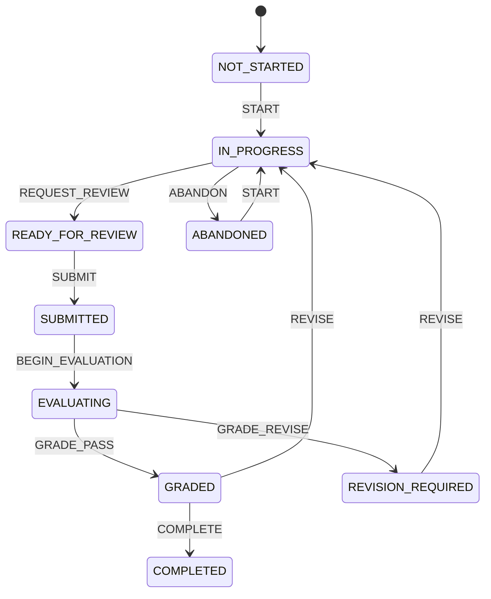

# Lab Run State Machine

## States

| State | Meaning | Learner can edit? |
| --- | --- | --- |
| `NOT_STARTED` | Run record does not have active work | No |
| `IN_PROGRESS` | Learner is editing | Yes |
| `READY_FOR_REVIEW` | Required draft checks pass | Yes |
| `SUBMITTED` | Immutable submission snapshot exists | No |
| `EVALUATING` | Checks or evaluation are running | No |
| `GRADED` | Passing result is ready | No, unless optional revision starts |
| `REVISION_REQUIRED` | Result identifies required corrections | No until revision starts |
| `COMPLETED` | Required passing workflow is closed | No |
| `ABANDONED` | Learner intentionally left the run | No until restart |

Production integration adds operational substates for queued, retryable failure, final failure, cancellation, and moderation without weakening the learning lifecycle.

## Primary flow

## Guards

### START

- Authorized learner owns the run.
- Entitlement is active.
- Scenario version remains accessible.
- Attempt policy allows work.

### REQUEST_REVIEW

- Required task payloads exist.
- Payload schemas pass.
- No unresolved blocking safety issue.

### SUBMIT

- Current server revision matches learner revision.
- Required validations pass.
- Learner confirms assessment attempt and cost.
- Credit reservation succeeds when evaluation uses a live model.

### BEGIN_EVALUATION

- Immutable submission snapshot exists.
- Evaluation idempotency key is unused or resolves to the same job.

### GRADE_PASS

- Deterministic checks pass.
- Required evaluator output validates.
- No blocking safety or integrity flag.
- Human approval exists when policy requires it.

### COMPLETE

- Passing evaluation exists.
- Evidence records are committed.
- Required competency update transaction succeeds.

## Failure states

Operational evaluation status is separate from learning state:

- `QUEUED`.
- `RUNNING`.
- `FAILED_RETRYABLE`.
- `FAILED_FINAL`.
- `CANCELLED`.
- `WAITING_FOR_HUMAN`.
- `SUCCEEDED`.

A provider timeout does not return the learning run to `IN_PROGRESS` or invent a grade. The run stays submitted while evaluation status communicates recovery choices.

## Idempotency

- Submission key: `runId + serverRevision + attemptNumber`.
- Evaluation key: `submissionId + evaluatorVersion`.
- Evidence key: `evaluationId + criterionId + evidenceType`.
- Completion key: `runId + passingEvaluationId`.

Repeated requests return the existing result.

## Concurrency

- `LabRun.serverRevision` increments on each confirmed save.
- Update requires expected revision.
- Conflict returns `409 RUN_REVISION_CONFLICT`.
- Client can reload server copy, copy local work, or perform a supported merge.
- Assessment submit is blocked until conflict resolution.

## Recovery

- Browser refresh reloads the last server-confirmed step and local unsynced draft when present.
- Offline edits show “Not synced.”
- Reconnect retries safe saves in order.
- A scenario retirement does not destroy active or historical runs.
- Admin cannot alter learner work through scenario editing.

## Audit events

Record state transition, actor, source state, target state, request ID, timestamp, and reason. Do not record raw answer content in the audit event.

