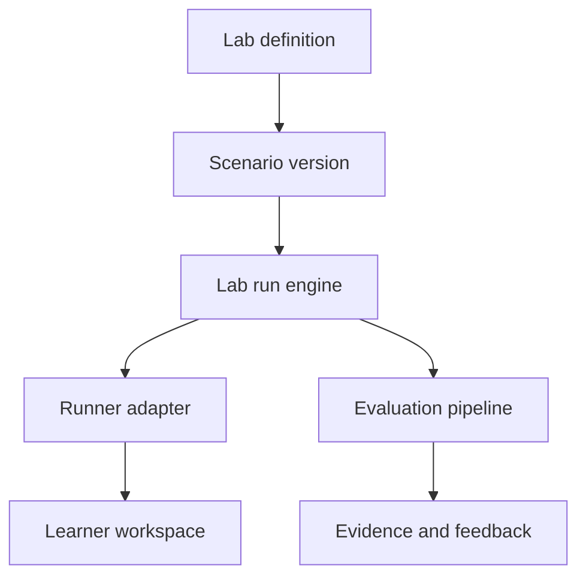

# Simulator Platform Technical Specification

## Purpose

Provide one versioned, auditable lab engine that can run many learning activities without hard-coding each scenario into a page.

## Product requirements

- Realistic synthetic work.
- Visible objective, constraints, and success criteria.
- Save and resume.
- Demo, practice, and assessment modes.
- Deterministic checks before model evaluation.
- Revision history and evidence.
- Mobile-safe interaction.
- Explicit AI cost and data boundary.
- No real external side effects in the MVP.

## Core architecture



## Domain objects

### LabDefinition

Stable identity and capability category.

- `id`.
- `slug`.
- `name`.
- `description`.
- `runnerType`.
- `supportedModes`.
- `requiredCapabilities`.
- `status`.

### LabVersion

Versioned runner configuration.

- UI schema version.
- Input and output contract versions.
- Allowed step types.
- Autosave policy.
- AI policy.
- Export policy.
- Release and retirement dates.

### ScenarioVersion

Immutable published learning challenge.

- Audience and difficulty.
- Estimated time.
- Brief and success criteria.
- Synthetic source pack.
- Required tasks.
- Hints by mode.
- Rubric version.
- Allowed model configuration.
- Variable-generation seed policy.

### LabRun

Learner-owned state container.

- User, workspace, enrollment, and entitlement references.
- Lab and scenario versions.
- Mode and state.
- Active step.
- Server revision number.
- Started, saved, submitted, evaluated, and completed times.
- Credit reservation and final usage.
- Safety, integrity, and review status.

### LabRunStep

Versioned answer or activity state.

- Stable task identifier.
- Input payload validated by step schema.
- Revision number.
- Client and server timestamps.
- Completion and validation state.
- Learner notes.

### Evaluation

- Evaluator type and version.
- Rubric version.
- Criterion scores.
- Evidence references.
- Confidence.
- Feedback.
- Safety and integrity flags.
- Human-review state.

## Runner interface

Every lab implements a typed adapter:

```ts
interface LabRunner<TScenario, TRunData, TSubmission, TDeterministicResult> {
  initialize(scenario: TScenario): TRunData;
  validateDraft(runData: TRunData): ValidationIssue[];
  buildSubmission(runData: TRunData): TSubmission;
  runDeterministicChecks(
    scenario: TScenario,
    submission: TSubmission,
  ): TDeterministicResult;
  summarizeEvidence(
    submission: TSubmission,
    result: TDeterministicResult,
  ): EvidenceReference[];
}
```

The domain adapter remains pure. Persistence, authorization, provider calls, and analytics wrap it at the application boundary.

## Modes

### Demo

- Precomputed source and output.
- Guided annotation.
- No live AI cost.
- No certificate evidence beyond Aware mastery.

### Practice

- Hints and checklists allowed.
- Live calls available with credits.
- Unlimited local revisions within entitlement policy.
- Evidence supports Guided mastery.

### Assessment

- Fixed scenario version and calibrated variable set.
- Restricted hints.
- Attempt limits.
- Pinned model configuration when AI is required.
- Evidence can support Independent or higher mastery.

## Step types

- Read brief.
- Inspect source.
- Classify.
- Free text.
- Structured form.
- Table edit.
- Ordered sequence.
- Workflow node and edge.
- Evidence link.
- Generate.
- Compare revisions.
- QA annotation.
- Reflection.
- Submit.

## Save protocol

1. Client edits local state.
2. Debounced save sends run ID, server revision, task ID, and validated payload.
3. Server verifies ownership, run state, scenario version, and entitlement.
4. Update uses optimistic concurrency on server revision.
5. Server returns new revision and confirmed time.
6. Conflict returns both revision identifiers and a recoverable merge choice.
7. Client never claims “Saved” before confirmation.

## Submission protocol

1. Learner requests review.
2. Runner validates required tasks.
3. Learner sees missing and warning issues.
4. Learner confirms submission and expected credit behavior.
5. Server locks the submission snapshot.
6. Deterministic checks run.
7. AI evaluation job runs when required.
8. Human moderation enters the queue when required or flagged.
9. Result becomes graded, revision required, or escalated.

## Version policy

- Published scenario versions are immutable.
- Draft edits create a new version.
- Active runs remain on their original version.
- New runs use the current approved version.
- Rubric or model changes do not reinterpret old scores.
- Retired versions remain readable for evidence verification.

## AI boundary

The lab engine requests AI work through the gateway with:

- Authorized learner and entitlement.
- Scenario, prompt, rubric, and model configuration versions.
- Redacted input payload.
- Structured output schema.
- Maximum input and output units.
- Timeout, retry, and cancellation policy.
- Credit reservation identifier.
- Correlation identifier.

The gateway returns structured result or explicit failure. It never writes a passing evaluation by itself.

## Events

- `lab_run_started_v1`.
- `lab_step_saved_v1`.
- `lab_validation_failed_v1`.
- `lab_submission_created_v1`.
- `lab_evaluation_started_v1`.
- `lab_evaluation_completed_v1`.
- `lab_revision_started_v1`.
- `lab_run_completed_v1`.
- `lab_run_abandoned_v1`.

Events exclude raw private content.

## Extension checklist

A new lab requires:

- Lab and runner specification.
- Input, run, submission, and result schemas.
- Scenario authoring standard.
- Rubric and evidence mapping.
- Deterministic tests.
- Sample published scenario.
- Demo fixture.
- Mobile interaction design.
- Accessibility checks.
- Safety and cost policy.
- Admin preview and validation.
- Analytics events.

